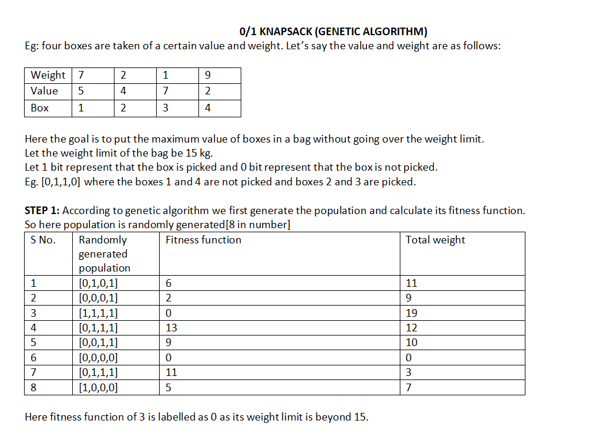
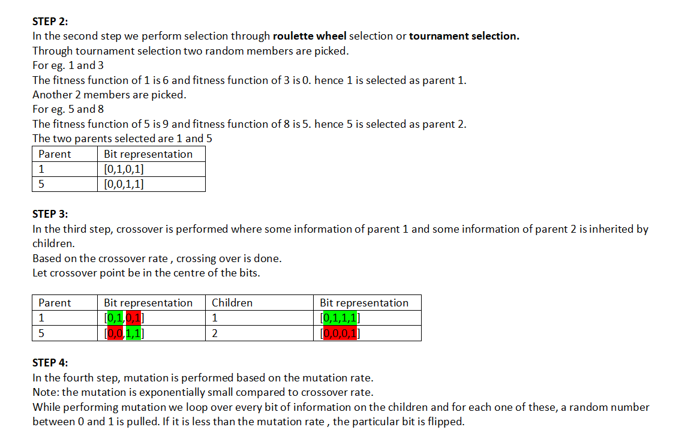
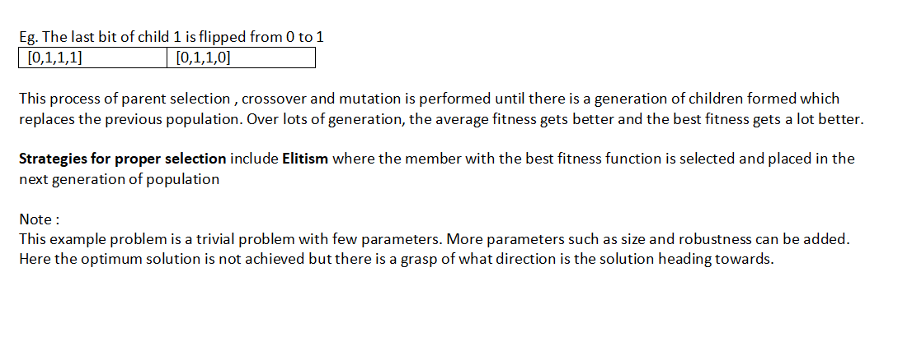

# 0/1 Knapsack

Let’s understand it using simple example, we have certain weights, and we want to have a number of weights to get the total weight maximum(the best possible combination), this is what Knapsack problem is. Here we have 0/1 that signifies we cant break the weights unlike fractional knapsack. So it means we have to find the maximum possible value of the weights without __BREAKING__ them.

- Given __N__ items, each item has some weight and a value associated with it,and also given a bag with capacity __W__ [i.e. the bag can at most hold __W__ weight in it].The 
  task is to put the items into the bag such that the sum of profits associated with them is the maximum possible. 
  
  __Note :__ The constraint here is we can either put an item completely into the bag or cannot put it at all [It is not possible to put a part of an item into the bag].

  __Example :__
  > __Input__: N = 3, W = 4, value[] = {1, 2, 3}, weight[] = {4, 5, 1}
  
  > __Output__: 3
  
  > __Explanation__:  There are two items which have weight less than or equal to 4. If we select the item with weight 4, the possible value is 1. And if we select the item with weight 1, the possible value is 3. So the maximum possible value is 3. Note that we cannot put both the items with weight 4 and 1 together as the capacity of the bag is 4.

- Genetic Algorithms help generate high-quality solutions to optimization problems, like Knapsack, but do not guarantee an optimal solution. Here's below an example of it :-

